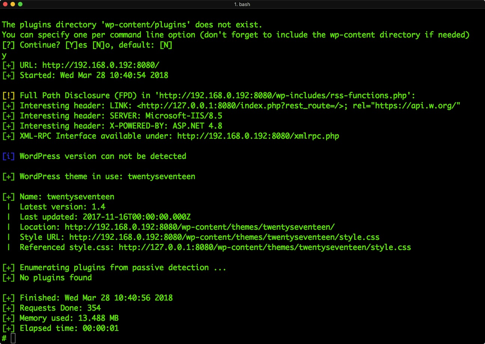
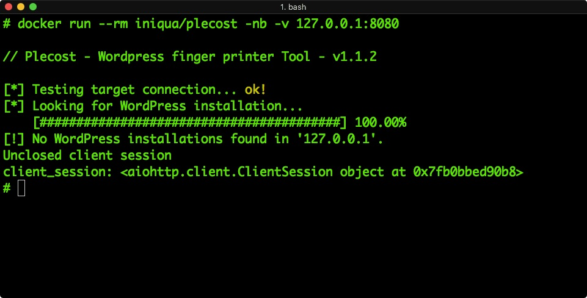
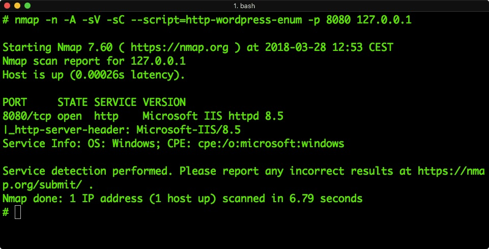

# Anti-hacking tools deployment of WordPress

This repo only do a small hardening of Wordpress, **without change any internal functionality** of Wordpress.

**The main goal is to disable hacking tools lik: WP-Scan or Plecost** 

## Remove Metas && versions from statics

Followed this: https://tehnoblog.org/wordpress-security-how-to-hide-wordpress-meta-generator-version-info/

## Changing default CSS / Javascript hashed

Some security tools for Wordpress check .css / .js files, calculate a hash and can determinate the version of Wordpress from these files. 

We change these files adding spaces at the ending of these files
  
# Examples


This docker image must be complemented with the *nginx-wordpress-docker-sec* image, that you can find at: https://github.com/cr0hn/nginx-wordpress-docker-sec

To quick test, you can download the *docker-compose.yml* form this repo and launch a complete hardened stack of Wordpress:

```yaml

version: "3"
services:

  wordpress:
    image: cr0hn/hardened-wordpress
    depends_on:
      - mysql
    environment:
      WORDPRESS_DB_PASSWORD: my-secret-pw
    volumes:
      - wordpress:/var/www/html

  nginx:
    image: cr0hn/nginx-wordpress-docker-sec
    depends_on:
     - wordpress
    volumes:
     - wordpress:/var/www/html/
    ports:
     - "8080:80"
    environment:
      POST_MAX_SIZE: 128m

  mysql:
    image: mysql:5.7
    environment:
      MYSQL_ROOT_PASSWORD: my-secret-pw
      MYSQL_DATABASE: wordpress


volumes:
  wordpress:
```

# Screenshots

If you deploy this version of configuration for Nginx + wordpress-docker-sec (see below) hacking tools will tell you something like:

## WP-Scan



## Plecost



## Nmap

